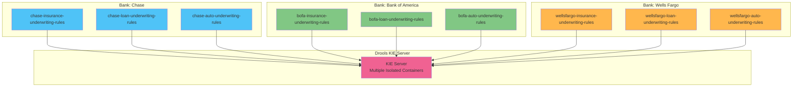
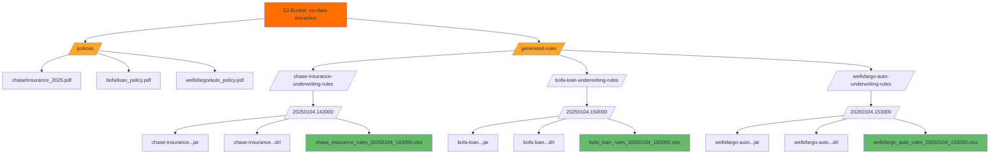
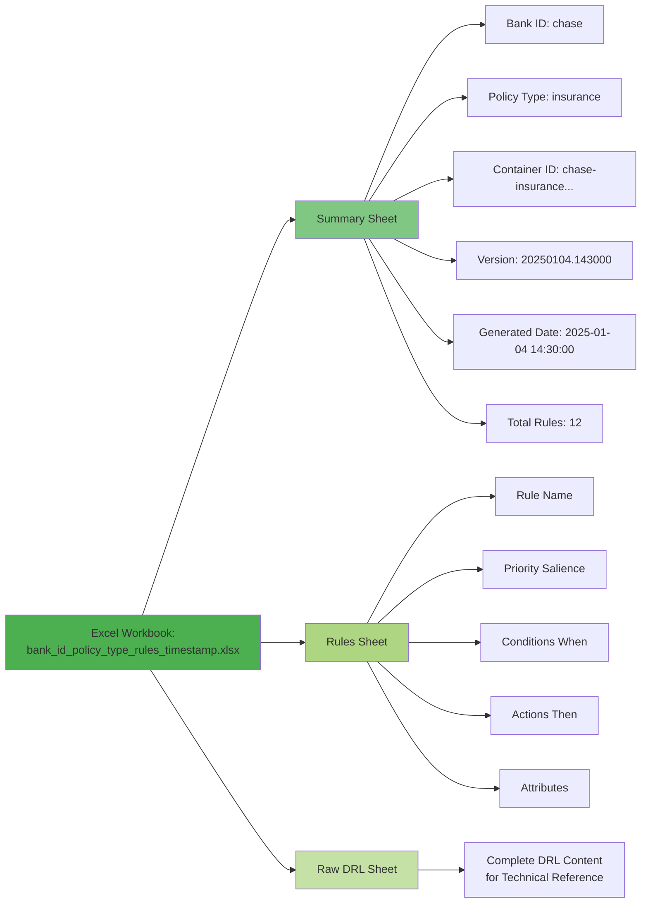
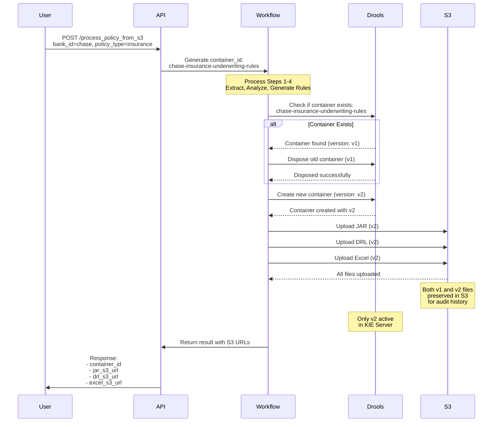
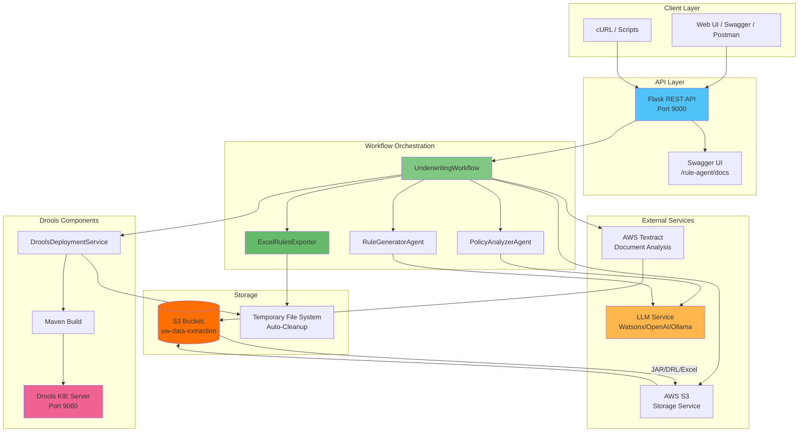

# Underwriting Rule Generation Workflow

This document provides visual diagrams of the complete underwriting workflow system.

## Complete Workflow Diagram

```mermaid
flowchart TD
    Start([User Request]) --> API[POST /process_policy_from_s3]

    API --> Input{Input Parameters}
    Input -->|Required| S3URL[S3 URL to Policy PDF]
    Input -->|Optional| PolicyType[Policy Type: insurance/loan/auto]
    Input -->|Recommended| BankID[Bank ID: chase/bofa/wells-fargo]
    Input -->|Optional| ContainerID[Container ID Override]

    S3URL --> Step0[Step 0: Parse S3 URL]
    PolicyType --> Step0
    BankID --> Step0

    Step0 --> ContainerGen{Container ID<br/>Provided?}
    ContainerGen -->|No| AutoGen[Auto-generate:<br/>bank_id-policy_type-underwriting-rules]
    ContainerGen -->|Yes| UseProvided[Use Provided Container ID]

    AutoGen --> Step1
    UseProvided --> Step1

    Step1[Step 1: Extract Text from PDF] --> S3Read{S3 or Local?}
    S3Read -->|S3| ReadS3[Read PDF from S3 into Memory<br/>No Local Download]
    S3Read -->|Local| ReadLocal[Read from Local File]

    ReadS3 --> PyPDF2[PyPDF2: Extract Text]
    ReadLocal --> PyPDF2

    PyPDF2 --> Step2[Step 2: Generate Extraction Queries]

    Step2 --> QueryType{Template or<br/>LLM Generated?}
    QueryType -->|Template| TemplateQ[Use Template Queries<br/>for Policy Type]
    QueryType -->|LLM| LLMGen[LLM Generates Custom Queries<br/>Based on Document]

    TemplateQ --> Step3
    LLMGen --> Step3

    Step3[Step 3: Extract Structured Data] --> TextractCheck{AWS Textract<br/>Available?}

    TextractCheck -->|Yes| TextractS3{S3 Document?}
    TextractS3 -->|Yes| TextractNative[Textract with S3Object<br/>No Download Required]
    TextractS3 -->|No| TextractLocal[Textract with Local File]

    TextractCheck -->|No| MockExtract[Mock Extraction<br/>LLM-based Text Analysis]

    TextractNative --> Step4
    TextractLocal --> Step4
    MockExtract --> Step4

    Step4[Step 4: Generate Drools DRL Rules] --> RuleGen[LLM Generates:<br/>- DRL Rules<br/>- Decision Tables<br/>- Explanations]

    RuleGen --> Step5[Step 5: Automated Drools Deployment]

    Step5 --> TempDir[Create Temporary Directory]
    TempDir --> SaveDRL[Save DRL File]
    SaveDRL --> CreateKJar[Create KJar Structure<br/>Maven Project Layout]
    CreateKJar --> MavenBuild[Maven Build:<br/>mvn clean install]

    MavenBuild --> BuildSuccess{Build<br/>Success?}
    BuildSuccess -->|No| BuildFail[Status: Partial<br/>Manual Build Required]
    BuildSuccess -->|Yes| CopyFiles[Copy JAR & DRL to<br/>Temp Location for S3]

    CopyFiles --> DeployKIE[Deploy to Drools KIE Server]

    DeployKIE --> ContainerExists{Container<br/>Exists?}
    ContainerExists -->|Yes| Dispose[Dispose Old Container]
    Dispose --> CreateNew[Create New Container<br/>with New Version]
    ContainerExists -->|No| CreateNew

    CreateNew --> DeploySuccess{Deployment<br/>Success?}
    DeploySuccess -->|No| DeployFail[Status: Partial<br/>KJar Built, Deployment Failed]
    DeploySuccess -->|Yes| CleanTemp[Auto-Delete Temp Build Directory]

    CleanTemp --> Step6[Step 6: Upload Files to S3]

    Step6 --> UploadJAR[Upload JAR File<br/>s3://bucket/generated-rules/<br/>container_id/version/file.jar]
    UploadJAR --> UploadDRL[Upload DRL File<br/>s3://bucket/generated-rules/<br/>container_id/version/file.drl]

    UploadDRL --> CheckBank{Bank ID<br/>Provided?}
    CheckBank -->|Yes| GenerateExcel[Generate Excel Spreadsheet]
    CheckBank -->|No| SkipExcel[Skip Excel Generation]

    GenerateExcel --> ParseDRL[Parse DRL Rules:<br/>- Rule Names<br/>- Conditions<br/>- Actions<br/>- Priority]

    ParseDRL --> CreateExcel[Create Multi-Sheet Excel:<br/>1. Summary Sheet<br/>2. Rules Sheet<br/>3. Raw DRL Sheet]

    CreateExcel --> UploadExcel[Upload Excel to S3<br/>Filename: bank_id_policy_type_rules_timestamp.xlsx]

    UploadExcel --> CleanExcel[Delete Temp Excel File]
    SkipExcel --> FinalClean
    CleanExcel --> FinalClean[Clean Up All Temp Files]

    FinalClean --> Response[Return Response JSON]
    BuildFail --> Response
    DeployFail --> Response

    Response --> ResponseContent{Response Contains}
    ResponseContent --> RC1[container_id]
    ResponseContent --> RC2[status: completed/partial/failed]
    ResponseContent --> RC3[jar_s3_url]
    ResponseContent --> RC4[drl_s3_url]
    ResponseContent --> RC5[excel_s3_url]
    ResponseContent --> RC6[Detailed Steps Results]

    RC1 --> End([Workflow Complete])
    RC2 --> End
    RC3 --> End
    RC4 --> End
    RC5 --> End
    RC6 --> End

    style Start fill:#e1f5e1
    style End fill:#e1f5e1
    style Step1 fill:#e3f2fd
    style Step2 fill:#e3f2fd
    style Step3 fill:#e3f2fd
    style Step4 fill:#e3f2fd
    style Step5 fill:#e3f2fd
    style Step6 fill:#e3f2fd
    style GenerateExcel fill:#fff3e0
    style CreateExcel fill:#fff3e0
    style UploadExcel fill:#fff3e0
    style DeployKIE fill:#f3e5f5
    style CreateNew fill:#f3e5f5
```

## Multi-Tenant Container Architecture

## S3 Storage Organization

## Excel Spreadsheet Structure

## Update/Replacement Flow

## System Architecture Overview

## Key Features

### 1. Zero Persistent Local Storage
- All files use temporary directories with automatic cleanup
- Input PDFs read directly from S3 into memory
- Maven builds in temp directories (auto-deleted after completion)
- Generated files (JAR, DRL, Excel) uploaded to S3 and then deleted locally

### 2. Multi-Tenant Isolation
- Separate containers per bank and policy type
- Format: `{bank_id}-{policy_type}-underwriting-rules`
- Examples:
  - `chase-insurance-underwriting-rules`
  - `bofa-loan-underwriting-rules`
  - `wellsfargo-auto-underwriting-rules`

### 3. Excel Export
- Automatically generated for each deployment (when bank_id provided)
- Filename includes bank and policy type: `{bank_id}_{policy_type}_rules_{timestamp}.xlsx`
- Three sheets: Summary, Parsed Rules, Raw DRL
- Uploaded to S3 alongside JAR and DRL files

### 4. Container Update Strategy
- Detects existing containers
- Disposes old version before creating new
- Preserves version history in S3
- Only latest version active in KIE Server

### 5. Flexible LLM Support
- Watsonx.ai
- OpenAI
- Ollama (local)
- Template queries (no LLM required)

### 6. AWS Integration
- Native S3 integration for document storage
- AWS Textract for intelligent data extraction
- Fallback to PyPDF2 + LLM when Textract unavailable
