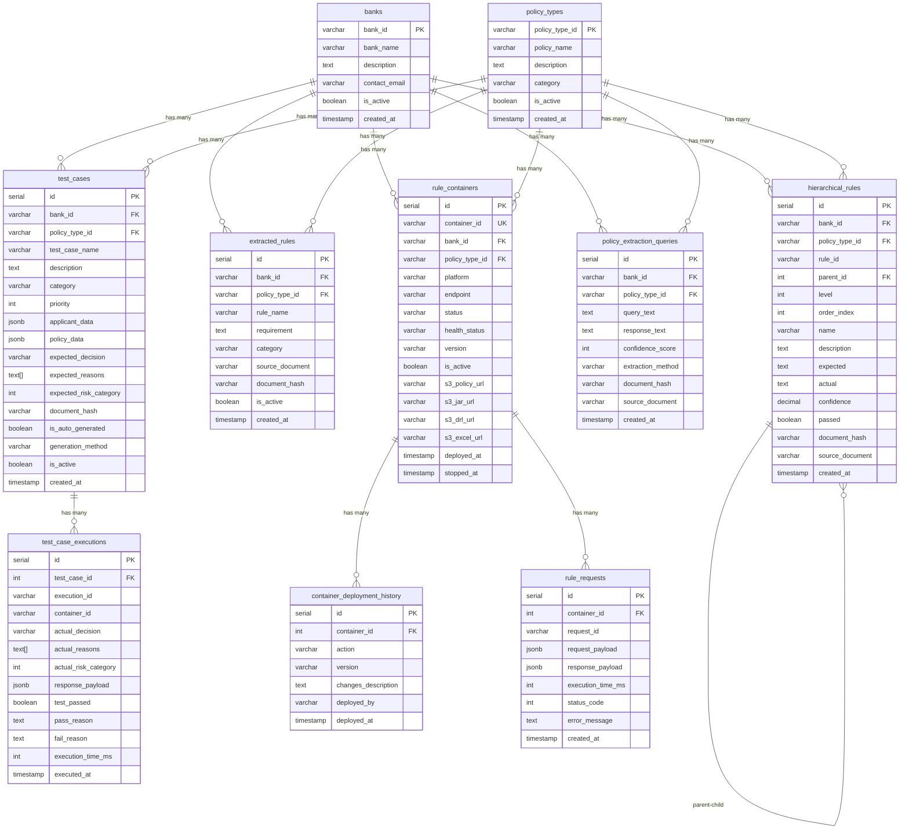

# Underwriting Rule Generation Workflow

This document provides visual diagrams of the complete underwriting workflow system.

## Complete Workflow Diagram

```mermaid
flowchart TD
    Start([User Request]) --> API[POST /process_policy_from_s3]

    API --> Input{Input Parameters}
    Input -->|Required| S3URL[S3 URL to Policy PDF]
    Input -->|Optional| PolicyType[Policy Type: insurance/loan/auto]
    Input -->|Recommended| BankID[Bank ID: chase/bofa/wells-fargo]
    Input -->|Optional| ContainerID[Container ID Override]

    S3URL --> Step0[Step 0: Parse S3 URL]
    PolicyType --> Step0
    BankID --> Step0

    Step0 --> ContainerGen{Container ID<br/>Provided?}
    ContainerGen -->|No| AutoGen[Auto-generate:<br/>bank_id-policy_type-underwriting-rules]
    ContainerGen -->|Yes| UseProvided[Use Provided Container ID]

    AutoGen --> Step01
    UseProvided --> Step01

    Step01[Step 0.1: Ensure Bank Exists] --> CheckBank{Bank Exists<br/>in Database?}
    CheckBank -->|No| CreateBank[Auto-create Bank Entry<br/>Normalized ID + Name]
    CheckBank -->|Yes| BankOK[Bank Ready]
    CreateBank --> Step02
    BankOK --> Step02

    Step02[Step 0.2: Ensure Policy Type Exists] --> CheckPolicy{Policy Type<br/>Exists?}
    CheckPolicy -->|No| CreatePolicy[Auto-create Policy Type<br/>Normalized ID + Name]
    CheckPolicy -->|Yes| PolicyOK[Policy Type Ready]
    CreatePolicy --> Step1
    PolicyOK --> Step1

    Step1[Step 1: Extract Text from Document] --> FormatDetect{Document<br/>Format?}
    FormatDetect -->|PDF| S3Read{S3 or Local?}
    FormatDetect -->|Excel| ExcelRead[Read Excel with pandas/openpyxl]
    FormatDetect -->|Word| WordRead[Read Word with python-docx]
    FormatDetect -->|Text| TextRead[Direct Text Read]

    ExcelRead --> ComputeHash
    WordRead --> ComputeHash
    TextRead --> ComputeHash
    S3Read -->|S3| ReadS3[Read PDF from S3 into Memory<br/>No Local Download]
    S3Read -->|Local| ReadLocal[Read from Local File]

    ReadS3 --> PyPDF2[PyPDF2: Extract Text]
    ReadLocal --> PyPDF2
    PyPDF2 --> ComputeHash

    ComputeHash[Compute SHA-256 Hash<br/>for Version Tracking] --> Step2[Step 2: Generate Extraction Queries]

    Step2 --> QueryType{Template or<br/>LLM Generated?}
    QueryType -->|Template| TemplateQ[Use Template Queries<br/>for Policy Type]
    QueryType -->|LLM| LLMGen[LLM Generates Custom Queries<br/>Based on Document]

    TemplateQ --> Step3
    LLMGen --> Step3

    Step3[Step 3: Extract Structured Data] --> TextractCheck{AWS Textract<br/>Available?}

    TextractCheck -->|Yes| TextractS3{S3 Document?}
    TextractS3 -->|Yes| TextractNative[Textract with S3Object<br/>No Download Required]
    TextractS3 -->|No| TextractLocal[Textract with Local File]

    TextractCheck -->|No| MockExtract[Mock Extraction<br/>LLM-based Text Analysis]

    TextractNative --> Step35
    TextractLocal --> Step35
    MockExtract --> Step35

    Step35[Step 3.5: Save Extraction Queries to DB] --> SaveQueries[Save to policy_extraction_queries:<br/>- query_text<br/>- response_text<br/>- confidence_score<br/>- document_hash]
    SaveQueries --> Step4

    Step4[Step 4: Generate Drools DRL Rules] --> RuleGen[LLM Generates:<br/>- DRL Rules<br/>- Decision Tables<br/>- Explanations]

    RuleGen --> Step45[Step 4.5: Save Extracted Rules to DB]

    Step45 --> ParseDRL2[Parse DRL Rules]
    ParseDRL2 --> TransformLLM[Transform to User-Friendly Text<br/>using OpenAI GPT-4]
    TransformLLM --> SaveExtracted[Save to extracted_rules:<br/>- rule_name<br/>- requirement (natural language)<br/>- category<br/>- document_hash]

    SaveExtracted --> Step46[Step 4.6: Generate Hierarchical Rules]

    Step46 --> HierarchicalAgent[HierarchicalRulesAgent<br/>Analyzes Policy with LLM]
    HierarchicalAgent --> GenerateTree[Generate Tree Structure:<br/>- Parent-child relationships<br/>- Unlimited nesting depth<br/>- Rule dependencies]
    GenerateTree --> SaveHierarchical[Save to hierarchical_rules:<br/>- rule_id (1.1.1)<br/>- parent_id<br/>- level, order_index<br/>- name, description<br/>- expected, confidence]

    SaveHierarchical --> Step47[Step 4.7: Generate Test Cases]

    Step47 --> TestCaseGen[TestCaseGenerator<br/>LLM Analyzes Policy + Rules]
    TestCaseGen --> GenerateTests[Generate 5-10 Test Cases:<br/>- Positive cases<br/>- Negative cases<br/>- Boundary cases<br/>- Edge cases]
    GenerateTests --> SaveTestCases[Save to test_cases:<br/>- test_case_name<br/>- description, category<br/>- applicant_data, policy_data<br/>- expected_decision<br/>- generation_method: llm/template]

    SaveTestCases --> Step5[Step 5: Automated Drools Deployment]

    Step5 --> TempDir[Create Temporary Directory]
    TempDir --> SaveDRL[Save DRL File]
    SaveDRL --> CreateKJar[Create KJar Structure<br/>Maven Project Layout]
    CreateKJar --> MavenBuild[Maven Build:<br/>mvn clean install]

    MavenBuild --> BuildSuccess{Build<br/>Success?}
    BuildSuccess -->|No| BuildFail[Status: Partial<br/>Manual Build Required]
    BuildSuccess -->|Yes| CopyFiles[Copy JAR & DRL to<br/>Temp Location for S3]

    CopyFiles --> CheckOrchestration{Container-Per-Ruleset<br/>Architecture?}

    CheckOrchestration -->|Yes| ContainerOrch[ContainerOrchestrator:<br/>Create Dedicated Container]
    ContainerOrch --> CreateDockerContainer[Create Docker/K8s Container:<br/>drools-{bank}-{policy}-rules<br/>Dedicated Port 8081+]
    CreateDockerContainer --> RegisterContainer[Register in rule_containers DB:<br/>- container_id<br/>- endpoint URL<br/>- platform: docker/k8s<br/>- status: deploying]

    CheckOrchestration -->|No| DeployKIE[Deploy to Shared KIE Server]

    RegisterContainer --> DeployToNewContainer[Deploy KJar to<br/>Dedicated Container]
    DeployToNewContainer --> UpdateContainerStatus[Update status: running<br/>Set health_status: healthy]

    DeployKIE --> ContainerExists{Container<br/>Exists?}
    ContainerExists -->|Yes| Dispose[Dispose Old Container]
    Dispose --> CreateNew[Create New Container<br/>with New Version]
    ContainerExists -->|No| CreateNew

    CreateNew --> DeploySuccess{Deployment<br/>Success?}
    UpdateContainerStatus --> DeploySuccess
    DeploySuccess -->|No| DeployFail[Status: Partial<br/>KJar Built, Deployment Failed]
    DeploySuccess -->|Yes| CleanTemp[Auto-Delete Temp Build Directory]

    CleanTemp --> Step6[Step 6: Upload Files to S3]

    Step6 --> UploadJAR[Upload JAR File<br/>s3://bucket/generated-rules/<br/>container_id/version/file.jar]
    UploadJAR --> UploadDRL[Upload DRL File<br/>s3://bucket/generated-rules/<br/>container_id/version/file.drl]

    UploadDRL --> CheckBank{Bank ID<br/>Provided?}
    CheckBank -->|Yes| GenerateExcel[Generate Excel Spreadsheet]
    CheckBank -->|No| SkipExcel[Skip Excel Generation]

    GenerateExcel --> ParseDRL[Parse DRL Rules:<br/>- Rule Names<br/>- Conditions<br/>- Actions<br/>- Priority]

    ParseDRL --> CreateExcel[Create Multi-Sheet Excel:<br/>1. Summary Sheet<br/>2. Rules Sheet<br/>3. Raw DRL Sheet]

    CreateExcel --> UploadExcel[Upload Excel to S3<br/>Filename: bank_id_policy_type_rules_timestamp.xlsx]

    UploadExcel --> CleanExcel[Delete Temp Excel File]
    SkipExcel --> FinalClean
    CleanExcel --> FinalClean[Clean Up All Temp Files]

    FinalClean --> Response[Return Response JSON]
    BuildFail --> Response
    DeployFail --> Response

    Response --> ResponseContent{Response Contains}
    ResponseContent --> RC1[container_id]
    ResponseContent --> RC2[status: completed/partial/failed]
    ResponseContent --> RC3[jar_s3_url]
    ResponseContent --> RC4[drl_s3_url]
    ResponseContent --> RC5[excel_s3_url]
    ResponseContent --> RC6[Detailed Steps Results]

    RC1 --> End([Workflow Complete])
    RC2 --> End
    RC3 --> End
    RC4 --> End
    RC5 --> End
    RC6 --> End

    style Start fill:#e1f5e1
    style End fill:#e1f5e1
    style Step1 fill:#e3f2fd
    style Step2 fill:#e3f2fd
    style Step3 fill:#e3f2fd
    style Step4 fill:#e3f2fd
    style Step5 fill:#e3f2fd
    style Step6 fill:#e3f2fd
    style GenerateExcel fill:#fff3e0
    style CreateExcel fill:#fff3e0
    style UploadExcel fill:#fff3e0
    style DeployKIE fill:#f3e5f5
    style CreateNew fill:#f3e5f5
```

## Policy Evaluation Workflow (Runtime)


## Database Schema



## Multi-Tenant Container Architecture


## S3 Storage Organization


## Excel Spreadsheet Structure


## Update/Replacement Flow


## System Architecture Overview


## Key Features

### 1. Auto-Create Bank & Policy Type (NEW!)
- **Step 0.1-0.2**: Automatically creates missing banks and policy types
- Prevents foreign key violation errors
- ID normalization: "Chase" → "chase", "Life Insurance" → "life-insurance"
- Idempotent: checks existence first, creates only if needed
- Auto-generates human-readable names and descriptions

### 2. Multi-Format Document Support (NEW!)
- **PDF**: PyPDF2 + AWS Textract
- **Excel**: pandas/openpyxl
- **Word**: python-docx
- **Text**: direct read
- Auto-detects format and selects appropriate extractor
- SHA-256 hash for version tracking

### 3. Hierarchical Rules Generation (NEW!)
- **Step 4.6**: LLM generates tree-structured rules
- Unlimited nesting depth with parent-child relationships
- Typical output: 5 top-level rules, 87 total rules
- Stored in `hierarchical_rules` table with self-referential parent_id
- Includes confidence scores from LLM (0.0-1.0)

### 4. Database Persistence (NEW!)
- **Step 3.5**: Saves extraction queries + Textract responses
- **Step 4.5**: Saves user-friendly extracted rules
- **Step 4.6**: Saves hierarchical rules tree
- Linked by document hash for version tracking
- Multi-tenant isolation via bank_id + policy_type_id

### 5. User-Friendly Rule Transformation (NEW!)
- Technical DRL rules → Natural language using OpenAI GPT-4
- Example: `WHEN: age < 18` → "Applicant must be 18 years or older"
- Stored in `extracted_rules` table with categories
- Frontend-ready for non-technical users

### 6. Drools Hierarchical Mapper (NEW!)
- **Single source of truth**: Uses Drools decision, NO re-evaluation
- 4 intelligent mapping strategies:
  1. Check rejection reasons for rule mentions
  2. Validate known fields against Drools data
  3. Use overall approval status
  4. Derive parent status from children
- Maps Drools decision → Hierarchical rules with pass/fail
- Returns rule evaluation summary (total, passed, failed, pass_rate)

### 7. Container-Per-Ruleset Architecture
- Each bank+policy gets dedicated Drools container
- Complete isolation, independent scaling, version control
- Dynamic creation via ContainerOrchestrator
- Registered in `rule_containers` database table
- Health monitoring and status tracking
- Example:
  - Port 8080: Default shared Drools (backward compat)
  - Port 8081: drools-chase-insurance-rules
  - Port 8082: drools-bofa-loan-rules

### 8. Zero Persistent Local Storage
- All files use temporary directories with automatic cleanup
- Input documents read directly from S3 into memory
- Maven builds in temp directories (auto-deleted after completion)
- Generated files (JAR, DRL, Excel) uploaded to S3 and then deleted locally

### 9. Multi-Tenant Isolation
- Separate containers per bank and policy type
- Format: `{bank_id}-{policy_type}-underwriting-rules`
- Examples:
  - `chase-insurance-underwriting-rules`
  - `bofa-loan-underwriting-rules`
  - `wellsfargo-auto-underwriting-rules`

### 10. Excel Export
- Automatically generated for each deployment (when bank_id provided)
- Filename includes bank and policy type: `{bank_id}_{policy_type}_rules_{timestamp}.xlsx`
- Three sheets: Summary, Parsed Rules, Raw DRL
- Uploaded to S3 alongside JAR and DRL files

### 11. Container Update Strategy
- Detects existing containers
- Disposes old version before creating new
- Preserves version history in S3
- Only latest version active in KIE Server

### 12. Flexible LLM Support
- OpenAI GPT-4 (primary for rule generation and transformation)
- Watsonx.ai
- IBM BAM
- Ollama (local)
- Template queries (no LLM required)

### 13. AWS Integration
- Native S3 integration for document storage
- AWS Textract for intelligent data extraction
- Fallback to PyPDF2 + LLM when Textract unavailable
- Pre-signed URLs for secure file access (24h expiration)

### 14. Automated Test Case Generation ✨ NEW!
- **Step 4.7**: LLM generates comprehensive test cases during policy processing
- 5-10 test cases per policy covering all scenarios
- Four categories: positive, negative, boundary, edge_case
- Stored in `test_cases` table with expected results
- Execution tracking in `test_case_executions` table
- Returned in GET /api/v1/policies with `include_test_cases=true`
- Template-based fallback when LLM fails

---

## Complete Workflow Steps Summary

### Policy Processing Workflow (10 Steps)

**Step 0**: Parse S3 URL and auto-generate container ID
- Format: `{bank_id}-{policy_type}-underwriting-rules`

**Step 0.1**: Ensure Bank Exists ✨ NEW!
- Check if bank exists in database
- Auto-create with normalized ID if missing
- Prevents foreign key violations

**Step 0.2**: Ensure Policy Type Exists ✨ NEW!
- Check if policy type exists in database
- Auto-create with normalized ID if missing
- Prevents foreign key violations

**Step 1**: Extract Text from Document ✨ ENHANCED!
- Multi-format support: PDF, Excel, Word, Text
- Auto-detect format
- Compute SHA-256 hash for versioning

**Step 2**: Generate Extraction Queries
- LLM analyzes document
- Generates custom queries based on content
- Identifies key sections and rule categories

**Step 3**: Extract Structured Data
- AWS Textract query-based extraction
- Returns data with confidence scores
- Fallback to LLM if Textract unavailable

**Step 3.5**: Save Extraction Queries to Database ✨ NEW!
- Save to `policy_extraction_queries` table
- Links queries to responses with confidence
- Document hash for version tracking

**Step 4**: Generate Drools DRL Rules
- LLM converts extracted data to DRL
- Generates decision tables
- Creates Excel format rules

**Step 4.5**: Save Extracted Rules to Database ✨ NEW!
- Parse DRL to extract individual rules
- Transform to user-friendly text using OpenAI GPT-4
- Save to `extracted_rules` table with categories

**Step 4.6**: Generate Hierarchical Rules ✨ NEW!
- LLM analyzes policy and generates rule tree
- Parent-child relationships, unlimited nesting
- Save to `hierarchical_rules` table
- Typical output: 87 rules in hierarchy

**Step 4.7**: Generate Test Cases ✨ NEW!
- LLM analyzes policy text, extracted rules, and hierarchical rules
- Generates 5-10 comprehensive test scenarios
- Covers positive, negative, boundary, and edge cases
- Save to `test_cases` table with expected results
- Template-based fallback if LLM fails

**Step 5**: Automated Drools Deployment
- Create KJar structure (Maven project)
- Build with Maven: `mvn clean install`
- Option 1: Deploy to dedicated container (container-per-ruleset)
- Option 2: Deploy to shared KIE server
- Register in `rule_containers` database

**Step 6**: Upload Files to S3
- Upload JAR, DRL, Excel to S3
- Generate pre-signed URLs (24h)
- Update container registry with S3 URLs
- Clean up temporary files

### Policy Evaluation Workflow (Runtime)

**Step 1**: Receive Application Data
- bank_id, policy_type_id
- applicant data (age, income, etc.)
- policy data (coverage, etc.)

**Step 2**: Lookup and Route to Container
- Query `rule_containers` table
- Find active container for bank+policy
- Health check container
- Resolve endpoint URL

**Step 3**: Invoke Drools Rule Engine
- Insert facts: Applicant, Policy, Decision
- Fire all rules
- Extract decision: approved/rejected, reasons, risk category

**Step 4**: Map to Hierarchical Rules ✨ NEW!
- Use DroolsHierarchicalMapper (single source of truth)
- No re-evaluation, only mapping
- Apply 4 intelligent strategies
- Mark each rule as passed/failed
- Extract actual values from Drools data

**Step 5**: Calculate Summary
- Total rules evaluated
- Passed count, failed count
- Pass rate percentage

**Step 6**: Return Complete Response
- Decision (approved/rejected)
- Hierarchical rules with pass/fail status
- Rule evaluation summary
- Execution time

---

## Recent Features (Highlighted with ✨)

1. **Auto-Create Bank & Policy Type** - Prevents FK violations
2. **Multi-Format Document Support** - PDF, Excel, Word, Text
3. **Database Persistence** - Steps 3.5, 4.5, 4.6, 4.7 save to DB
4. **Hierarchical Rules Generation** - Tree-structured rules with LLM
5. **User-Friendly Rule Transformation** - DRL → Natural language
6. **Drools Hierarchical Mapper** - Single source of truth, no re-evaluation
7. **Container-Per-Ruleset** - Dedicated Drools containers per tenant
8. **Document Hash Versioning** - SHA-256 tracking across all tables
9. **Automated Test Case Generation** - LLM-powered test scenarios with execution tracking

---

## File References

**Main Workflow:**
- [rule-agent/UnderwritingWorkflow.py](rule-agent/UnderwritingWorkflow.py) - Complete orchestration

**LLM Agents:**
- [rule-agent/PolicyAnalyzerAgent.py](rule-agent/PolicyAnalyzerAgent.py) - Query generation
- [rule-agent/RuleGeneratorAgent.py](rule-agent/RuleGeneratorAgent.py) - DRL generation
- [rule-agent/HierarchicalRulesAgent.py](rule-agent/HierarchicalRulesAgent.py) - Tree generation
- [rule-agent/TestCaseGenerator.py](rule-agent/TestCaseGenerator.py) - Test case generation

**Rule Services:**
- [rule-agent/DroolsService.py](rule-agent/DroolsService.py) - Drools integration
- [rule-agent/DroolsHierarchicalMapper.py](rule-agent/DroolsHierarchicalMapper.py) - Intelligent mapping

**Database:**
- [rule-agent/DatabaseService.py](rule-agent/DatabaseService.py) - All DB operations
- [db/migrations/001_create_extracted_rules_table.sql](db/migrations/001_create_extracted_rules_table.sql)
- [db/migrations/002_create_policy_extraction_queries_table.sql](db/migrations/002_create_policy_extraction_queries_table.sql)
- [db/migrations/003_create_hierarchical_rules_table.sql](db/migrations/003_create_hierarchical_rules_table.sql)
- [db/migrations/004_create_test_cases_table.sql](db/migrations/004_create_test_cases_table.sql)

**API:**
- [rule-agent/ChatService.py](rule-agent/ChatService.py) - REST endpoints
- [rule-agent/swagger.yaml](rule-agent/swagger.yaml) - API documentation

**Documentation:**
- [AUTO_CREATE_BANK_POLICY.md](AUTO_CREATE_BANK_POLICY.md) - Auto-creation feature
- [COMPLETE_HIERARCHICAL_RULES_SUMMARY.md](COMPLETE_HIERARCHICAL_RULES_SUMMARY.md) - Hierarchical rules
- [DROOLS_MAPPER_IMPLEMENTATION.md](DROOLS_MAPPER_IMPLEMENTATION.md) - Mapper logic
- [CONTAINER_PER_RULESET.md](CONTAINER_PER_RULESET.md) - Container architecture
- [TEST_CASES_FEATURE.md](TEST_CASES_FEATURE.md) - Test case generation and execution
